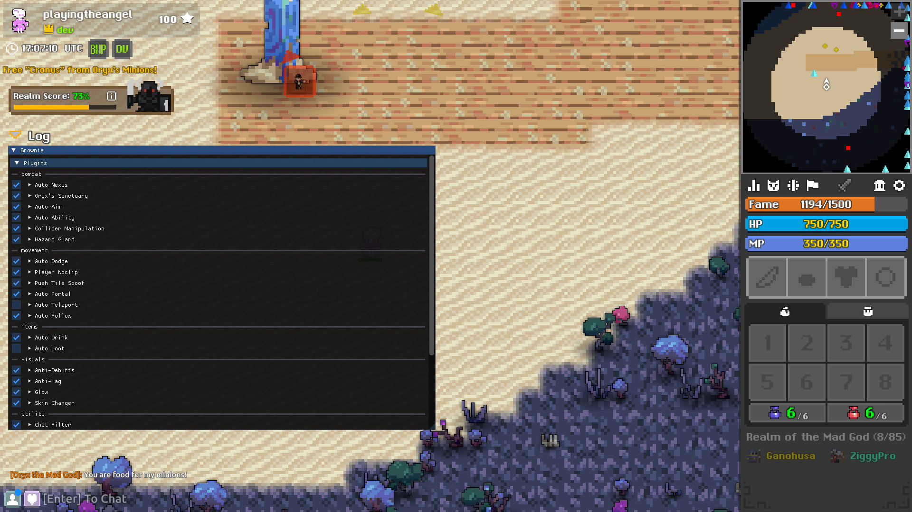
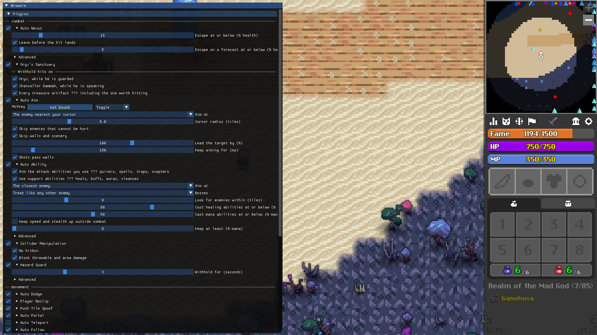
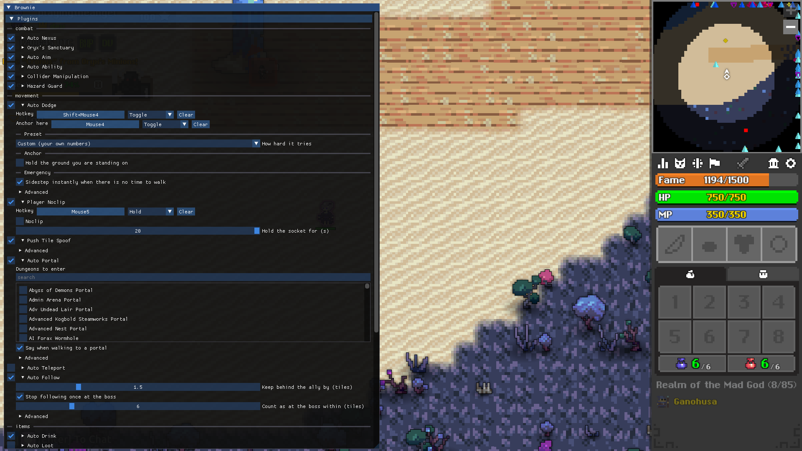
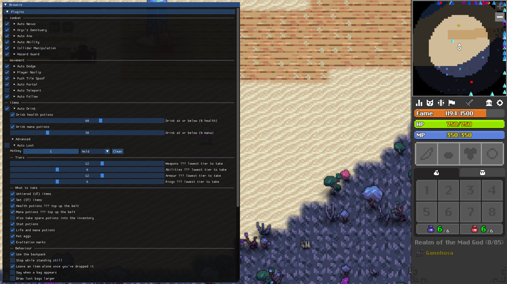
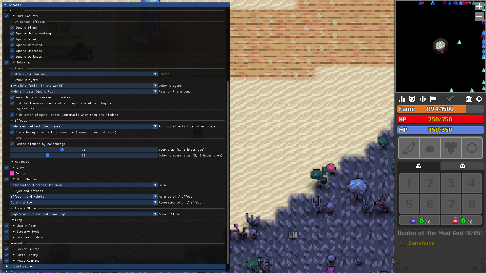
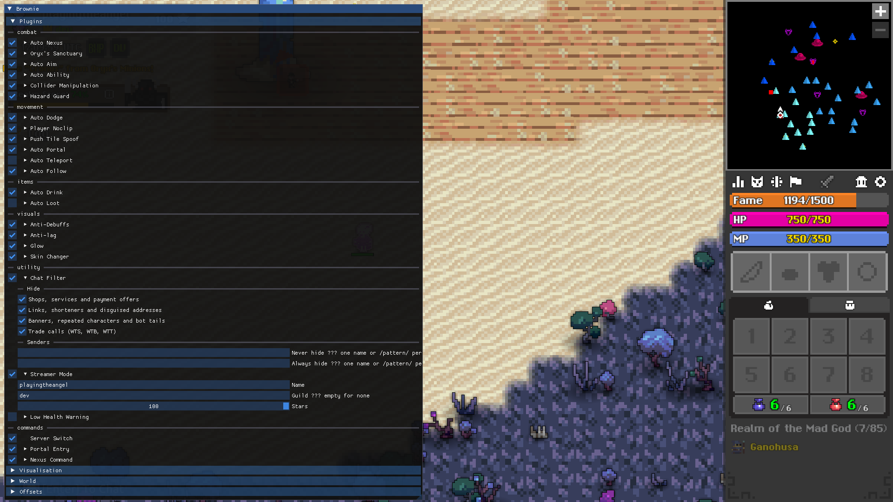

# Brownie

A MITM proxy and automation runtime for Realm of the Mad God (Exalt) on Windows
x64, plus an injected native module that talks to the game process directly.

Everything the runtime does is a plugin, and every plugin is switched on,
configured and bound to a key from an ImGui overlay drawn inside the game.

<!-- SCREENSHOT: the overlay open over the game, showing the plugin list -->



## How it fits together

Two processes, two languages, one contract between them:

```
      Exalt (game process)
        │            ▲
 TCP    │            │  in-process
        ▼            │
┌─────────────────┐  │   ┌──────────────────────────┐
│  Node runtime   │  └───│  native module (C++)     │
│                 │      │  d3d11.dll               │
│  proxy ⇄ server │◄───►│  IL2CPP hooks + overlay  │
└─────────────────┘ pipe └──────────────────────────┘
        │
        ▼
   game server
```

# Features

Every feature below is a plugin. Each one has a switch, its own settings, and
its state persists between runs in `config/plugins.json` — written by clicking,
not by editing. Settings marked *advanced* are hidden behind the overlay's
advanced toggle; the ones listed first are what you actually change.

## Combat

### Auto Nexus

Escapes to the Nexus before you die, and does it twice over. Health is tracked
ahead of the server, so a hit counts the moment it lands rather than a round
trip later — and the shots already in the air are counted against that health
too, so it can leave on a forecast instead of waiting for the damage. Once it
has escaped, the hits the escape was racing are dropped, so they never apply.

- **Escape at or below (% health)** — the ordinary threshold, 25 by default.
- **Leave before the hit lands** — act on shots in flight, not only on damage
  already taken.
- **Escape on a forecast at or below (% health)** — a separate, much lower
  floor for predictions, 10 by default. A forecast is a guess; shots get dodged
  and walked out of, so this is deliberately far below the threshold above.
- *Advanced:* how far ahead to count inbound shots (ms), and escaping on a shot
  spawned right on top of you (tiles).

Bindable to a key.

### Auto Aim

Points the shots *you* fire at the enemy they are most likely to hit. It never
shoots for you and never moves your mouse — you decide when to fire, and only
the angle changes, inside the client's own call to compute it. Moving targets
are led, so the shot goes where the enemy will be.

- **Aim at** — the closest enemy, the weakest, the toughest, or the enemy
  nearest your cursor.
- **Cursor radius (tiles)** — how far from the cursor an enemy may be and still
  count, when aiming by cursor.
- **Skip enemies that cannot be hurt** — invulnerable and untargetable things.
- **Skip walls and scenery.**
- **Lead the target by (%)** — 0 aims where it is, 100 aims where it will be.
- **Keep aiming for (ms)** — how long an aim survives without a fresh sighting.
- **Shots pass walls** — your projectiles are not stopped by scenery.

Bindable to a key.

### Auto Ability

Handles the ability slot in two halves. Support abilities — heals, buffs,
auras, cleanses — are cast when what they give is worth having *right now*, not
when a timer says so: a tome is not fired at full health, and an aura is not
raised with nothing to use it on. Attack abilities — quivers, spells, traps,
scepters — are never cast for you, only pointed at an enemy instead of at the
mouse when you fire them. What an ability does is read from the game's own item
data, so a new class or a new item is understood without an update.

- **Use support abilities** and **aim the attack abilities you use** — the two
  halves, switched separately.
- **Aim at** and **cursor radius (tiles)** — the same four choices auto-aim
  offers.
- **Bosses** — treat like any other enemy, prefer them, or only them.
- **Look for enemies within (tiles).**
- **Cast healing abilities at or below (% health)** and **mana abilities at or
  below (% mana)**.
- **Keep speed and stealth up outside combat.**
- **Keep at least (% mana)** — a reserve it will not spend into.
- *Advanced:* minimum wait between casts (ms).

### Collider Manipulation

Shrinks the local player's collision circle so there is less of you to hit, and
optionally withholds the report the server uses to apply thrown and area
damage. Your health bar is tinted while it is active, so the state is visible
without opening the overlay.

- **No hitbox** — collapse the collider entirely.
- **Collision radius multiplier** — 0 to 1, 0.5 by default.
- **Block throwable and area damage.**

### Hazard Guard

Standing in lava or on damaging ground is something only your client knows, so
the report is withheld — in recharging windows rather than outright, because a
server that hears nothing at all eventually drops the connection. One tick of
damage every few seconds instead of two a second, with a countdown drawn over
your character showing what is left of the current window.

- **Withhold for (seconds)** — 3 by default, 8 at most.
- *Advanced:* how long out of the damage counts as having walked out (ms).

### Oryx's Sanctuary

Three Sanctuary mechanics punish you for landing a hit instead of taking
damage. Those hits are withheld, each rule switched separately.

- **Oryx, while he is guarded.**
- **Chancellor Dammah, while he is speaking.**
- **Every treasure artifact** — off by default, because it withholds hits on
  all three, the right one included.

`/o3` reports what the tracking currently sees.

<!-- SCREENSHOT: the Combat plugins expanded in the overlay -->



## Movement

### Auto Dodge

A planner over every shot in flight, the walls, damaging ground, enemy bodies
and thrown-bomb telegraphs. It stays quiet while your own walking is fine and
speaks only when your course is genuinely about to cost you — then continuously
until it does not have to. Holding `Ctrl` and the middle mouse button to walk
somewhere outranks it entirely: a person pointing at a place has more
information than any planner.

- **How hard it tries** — *Relaxed* (steps in late, leaves your walking alone),
  *Balanced* (what it was tuned at), *Cautious* (wide margins, takes the wheel
  sooner), or *Custom* for your own numbers.
- **Hold the ground you are standing on** — an anchor it keeps you near while
  it dodges, for holding a spot in a fight. Bindable to its own key, so it can
  be re-anchored mid-fight without opening the overlay.
- **Sidestep instantly when there is no time to walk** — a short emergency hop
  for shots that arrive faster than walking can answer.
- *Advanced, grouped:* **Reaction** (how far ahead to look, planning step,
  how urgent trouble must be, directions considered, thinking budget),
  **Safety** (caution, extra margin, distrust of far predictions, wall and
  hazard clearance, dodging bombs), **Spacing** (how far monsters are kept),
  **Control** (leaving your own walking alone, cancelling your input while it
  drives, walking speed, `Ctrl`+middle-click walk-to-cursor).

Bindable to a key.

### Player Noclip

Walk through the trees, rocks and scenery standing on the map. The client's own
walkability check is silenced, and the connection is held in both directions
while it is on so the server never pulls you back — which is what makes it work
at all instead of rubber-banding. That hold is on a budget: a countdown appears
over your character, and the plugin switches itself off when it runs out.

- **Noclip** — the switch a key moves, so it can be armed and disarmed
  mid-fight.
- **Hold the socket for (s)** — 20 at most.

Bindable to a key.

### Auto Follow

Walks after an ally, keeping the distance you asked for rather than piling onto
them. `Shift` + left-click on an ally names them; clicking where nobody stands
cancels. Auto-teleport can name one for you. It lets go on its own when the
ally is gone from the map.

- **Keep behind the ally by (tiles).**
- **Stop following once at the boss**, and **count as at the boss within
  (tiles)** — so you are not dragged past the fight you were brought to.
- *Advanced:* stop while you are steering by hand.

### Auto Portal

Stand in the Nexus and be taken into a dungeon the moment somebody opens one
you chose. It walks to the nearest matching portal and enters it. It never acts
while you are steering yourself.

- **Dungeons to enter** — a checklist of dungeon portals.
- **Say when walking to a portal.**
- *Advanced:* stop while you are steering by hand.

### Auto Teleport

In a dungeon, when a teammate reaches the boss and you are not there yet, it
teleports to them — then hands them to auto-follow so you are walked into the
fight. Maps that refuse teleports are learnt rather than retried forever.

- **Count a teammate as at the boss within (tiles).**
- **Follow the teammate after teleporting.**
- **Say when teleporting.**

### Push Tile Spoof

Conveyors, whirlpools and sludge arrive as ordinary ground, so they stop
dragging you around. Which tiles push is read from the game's own tile data, so
it stays correct when the game adds another.

- *Advanced:* which ground type to replace them with.

Ground is announced once per map, so switching this on affects tiles not yet
revealed, and switching it off leaves what was already replaced until the next
map.

<!-- SCREENSHOT: the Movement plugins expanded, ideally Auto Dodge with its presets -->



## Items

### Auto Loot

Takes what is worth taking out of the bag you are standing on. What counts as a
bag, an item or a potion comes from the game's own data, so nothing here goes
stale after a patch. A pickup is never confirmed by the protocol, so a move is
sent, waited on, and abandoned rather than assumed — a bag somebody emptied
first costs nothing.

**Tiers** — the lowest tier to take, per kind: weapons, abilities, armour,
rings.

**What to take**

- Untiered (UT) items, Set (ST) items, stat potions, life and mana potions, pet
  eggs, exaltation marks.
- Health and mana potions, to top up the belt — and optionally spare ones into
  the inventory.
- *Advanced:* a minimum number of enchants an item must carry (uncommon through
  divine), plus always-take and never-take lists by object id.

**Behaviour**

- **Use the backpack**, **stop while standing still**, **leave an item alone
  once you have dropped it**, **say when a bag appears**, **draw loot bags
  larger**.
- *Advanced:* least time between pickups, drinking stat potions straight from
  the bag, and standing down when you move a potion yourself.

Bindable to a key.

### Auto Drink

Drinks health and mana potions when the bar falls past a threshold, out of
whichever slots the server has actually stated. Note that it does not
coordinate with auto-nexus: a nexus threshold at or above the drink threshold
means leaving the map before a potion is ever reached for.

- **Drink health potions** / **drink at or below (% health)**.
- **Drink mana potions** / **drink at or below (% mana)**.
- *Advanced:* drain the potion belt first, and the wait between drinks.

<!-- SCREENSHOT: Auto Loot expanded, showing the tier and "what to take" groups -->



## Visuals

### Glow

Puts a glow of your own colour around your character, in this client only. No
stat carries a colour, so this happens entirely inside the game process — the
server is never told, and no other player sees it.

- **Colour** — a picker with red, green, blue and alpha.

### Skin Changer

Changes your character's skin, dyes and arcane style in this client only, and
remembers the choice per class.

- **Skin** — every skin the game has for that class.
- **Main colour / effect** and **accessory colour / effect** — dyes.
- **Arcane Style.**

### Anti-lag

Trims what the client has to simulate and draw, which is what a crowded realm
or a full dungeon actually costs in frames. Start from a preset and adjust.

- **Preset** — *Off*, *Fewer particles*, *Crowded maps* (small allies, no ally
  shots, no pets), *Maximum FPS* (remove allies, pets and their shots), or
  *Custom*.
- **Other players** — show normally, invisible but still in the world, or
  removed from the world entirely.
- **Pets on the ground** — show, hide other players' but keep yours, hide all,
  or remove all.
- **Never hide or resize guildmates.**
- **Hide other players' shots** — automatic once they are hidden.
- **Ability effects from other players** — show, hide their heals and buff
  auras, or hide every effect they cause.
- **Block heavy effects from everyone** — beams, novas, streams — with an
  advanced list of effect types.
- **Hide heal numbers and status popups from other players.**
- **Size** — resize players by percentage: your size and other players' size,
  where 0 hides them.

Objects removed from the world stay removed until the next map change.

### Anti-Debuffs

Stops the client *drawing* condition effects that are only a nuisance on
screen — one checkbox per effect. The server still holds and expires them
normally; this changes what you see, not what is true.

<!-- SCREENSHOT: Anti-lag expanded with its preset and groups -->



## Utility

### Chat Filter

Drops shop-bot and spam messages before the client ever draws them, so they
never enter your chat history either. You, the server and NPCs are never
filtered. Nothing you say is read or written.

- **Hide** — shops, services and payment offers; links, shorteners and
  disguised addresses; banners, repeated characters and bot tails; trade calls
  (WTS, WTB, WTT).
- **Senders** — a never-hide list and an always-hide list, one name or
  `/pattern/` per line. Blocked wins over allowed.

`/chatfilter` shows what it has hidden this session.

### Streamer Mode

Puts a stand-in identity over your character and through the chat box — the
name, the guild and the star count, plus who a line is from, who it is addressed
to, and anywhere somebody says your name. All three together, because a stand-in
name is not a disguise while the guild beside it is still yours. This is
server→client only: the game server, everyone else's client and anything you
send still carry the real identity, so `/tell` and trades keep working.

- **Name** — the alias, up to 16 characters. Empty leaves your name alone.
- **Guild** — what the guild reads as. Empty shows no guild, which is the
  ordinary state of most characters and a disguise in itself.
- **Stars** — the star rank drawn beside the name and in the chat box.

The identity is stated twice on entering a world — once as the character is
created and once on the tick after — because the client seeds its own player
from more than the packet that creates it, and the first claim alone did not
survive the map change.

<!-- SCREENSHOT: Chat Filter and Streamer Mode expanded -->



## Chat commands

Typed in the game's own chat box. A command a plugin claims is dropped before
the server sees it; anything else — `/tell`, `/who`, `/trade` — passes through
untouched.

| Command | What it does |
|---|---|
| `/back` | Go back through the last portal, replaying the seat the server already handed out — so no queue. |
| `/enter` | Use the portal under you, however full the client believes it is. |
| `/con <server>` | Move the character to another game server by name. |
| `/ip` | Which game server this session is connected to. |

## Keys

Bound from the overlay, per plugin, as either a toggle or a hold. Auto-aim,
auto-loot, auto-dodge (its switch and a second key for *anchor here*) and
player noclip offer one; the module watches the keyboard and the runtime
decides what a press means.

Three chords are the module's own and are not bindable:

| Chord | What it does |
|---|---|
| `F1` | Open and close the overlay. |
| `Ctrl` + middle mouse | Walk to the cursor — the one thing that outranks the dodge planner. |
| `Shift` + left click | Name the ally auto-follow should follow. Clicking empty ground cancels. |

# Getting started

```bash
npm install
```

```bash
npm run check
```

`check` runs, in order: typecheck, lint, format check, tests. It is what CI
runs and what a change is expected to pass before it lands.

Individually:

```bash
npm run build        # tsc project references
npm test             # vitest
npm run test:watch
npm run lint
npm run format
```

Two profilers, for when a change is meant to make something cheaper. Neither
asserts anything — they report, so a change has a before and an after:

```bash
npm run profile:ipc    # the Node hot paths: ns/op, allocations, frames on the wire
npm run profile:link   # the real module over a real pipe: idle cost, latency, throughput
```

## Building the native module

```bash
npm run build:native     # apps/native/build/d3d11.dll
```

```bash
npm run test:native      # builds and runs the self-check
```

The compiler is Zig's clang, installed as an ordinary dev dependency — no
Visual Studio and no separate SDK, with the version pinned in the lockfile like
everything else. `ZIG=<path>` overrides it.

# Running

One command prepares a live run: it builds the module and the runtime, extracts
the game's data if it is missing, installs `d3d11.dll` into the game folder,
starts the runtime with the overlay enabled, and then waits.

```bash
npm run live
```

**It does not launch the game** — start it however you normally do, then press
`F1` in it for the overlay. `Ctrl-C` in the terminal stops the runtime and
lets it shut down cleanly. The run is also written to `logs/runtime.log`.

For a per-packet trace:

```bash
BROWNIE_LOG_LEVEL=trace npm run live
```

Or run the proxy on its own, with no module and no overlay:

```bash
npm run build
```

```bash
node apps/runtime/dist/main.js
```

## Configuration

Layered: built-in defaults ← `config/runtime.json` ← environment. A missing
config file is normal — defaults plus the environment are a complete
configuration. `BROWNIE_CONFIG` moves the file; what you click in the overlay
is persisted to `plugins.json` beside it.

| Key | Environment | Default |
|---|---|---|
| `proxy.host` / `proxy.port` | `BROWNIE_PROXY_HOST` / `BROWNIE_PROXY_PORT` | `127.0.0.1:2050` |
| `servers.allow` | — | `[]` — a session is refused unless its target is listed |
| `servers.port` | — | `2050` |
| `native.enabled` | `BROWNIE_NATIVE` | `false` — implied by a configured secret |
| `native.pipeName` | `BROWNIE_NATIVE_PIPE` | `brownie-bridge` |
| `native.secret` | `BROWNIE_NATIVE_SECRET` | empty — one is minted per run and published where the module reads it |
| `logging.level` | `BROWNIE_LOG_LEVEL` | `info` |
| `logging.file` | `BROWNIE_LOG_FILE` | none — terminal only |
| `gameData.directory` | `BROWNIE_GAME_DATA_DIR` | none — objects and tiles stay unclassified |
| `plugins.directory` | `BROWNIE_PLUGIN_DIR` | `plugins` |

**The allowlist fills itself when the module is running.** A host the module
saw the game's *own* `connect` head for permits itself — that is where the game
had already decided to go. `servers.allow` is what a host arriving from
anywhere else is checked against, so the proxy can never become an open relay.

Setting `logging.file` writes the same lines the terminal gets to a file as
well, **truncated on every start** so it always holds exactly one run — which is
what makes "what did it say when that happened?" answerable by someone who was
not watching, and greppable.

# Writing a plugin

Drop a `.js` or `.mjs` file into `plugins/`. It is loaded at startup, and saving
it reloads it mid-session — no restart, no rebuild. `setup` runs once while the
plugin is still disabled: it declares settings, subscribes to packets and
registers commands, and the host gates delivery on the switch. A plugin that
throws is switched off, never fatal.

```ts
import { definePlugin, PluginCategory } from '@brownie/plugin-api';

export default definePlugin({
  meta: { id: 'auto-nexus', name: 'Auto Nexus', category: PluginCategory.Combat },
  setup(ctx) {
    const threshold = ctx.settings.range('hpPercent', { default: 25, min: 1, max: 99 });
    ctx.packets.onFirst('NEWTICK', (packet, session) => {
      const { hp, maxHp } = session.self;
      if (maxHp > 0 && (hp / maxHp) * 100 <= threshold.get()) {
        session.sendToServer('ESCAPE', {});
      }
    });
  },
});
```

Declaring a setting is what draws its control in the overlay and what persists
it — booleans, numbers, sliders, one-of-N and many-of-N choices, text and
colours. `plugins/low-health-warning.js` and `plugins/nexus-command.js` are
worked examples. See [`docs/plugins.md`](docs/plugins.md).

# Where the game's data comes from

`objects.xml` and `tiles.xml` are the game's own files, shipped inside its Unity
asset bundle. They are **not** checked in: they are 30 MB, they belong to Deca,
and they change with every patch. Extract them from your own install (after
`npm run build`, or let `npm run live` do it):

```bash
npm run gamedata extract
```

| Command | What it does |
|---|---|
| `npm run gamedata where` | prints where the game was found |
| `npm run gamedata extract` | writes `objects.xml`, `tiles.xml`, enchantment data and a manifest to `./game-data` |
| `npm run gamedata check` | exits non-zero if the extracted data no longer matches the install |

Point the runtime at the result with `gameData.directory` (or
`BROWNIE_GAME_DATA_DIR`). The manifest records which asset bundle the data came
from, so the runtime warns at startup when the game has been patched since:

```
warn  brownie  game data is out of date — the installed game no longer matches
                what this data came from
warn  brownie  run `npm run gamedata extract` to refresh it
```

Extraction is a separate tool rather than something the runtime does on its own,
because it reads a 375 MB bundle, needs to run once per game patch rather than
once per launch, and produces files a person may want to inspect or copy to
another machine.

# IL2CPP metadata

`tools/extractor` is a separate Go program that recovers and decrypts the game's
`global-metadata.dat`, catalogs packet names, finds native packet handlers and
diffs builds. The native module needs its output to resolve IL2CPP classes after
a game patch — the metadata is encrypted, so it cannot simply be read off disk.

It is kept as its own tool, in its own language, because that is what it already
is: a working program with its own release cycle. Vendoring it into this build
would mean maintaining a rewrite of it.

```bash
cd tools/extractor && go build -o extractor ./cmd/extractor && ./extractor -once
```

# Where the packet definitions are

`packages/protocol/data/packet-definitions.json` and
`packages/protocol/data/stat-types.json`. They are data, not generated code: a
game patch that moves a field is a JSON edit, validated and round-tripped by
`npm test`, with no rebuild. See [`docs/protocol.md`](docs/protocol.md).

# Layout

```
.
├── packages/
│   ├── protocol/      RotMG wire protocol. Pure, zero dependencies, no I/O.
│   ├── ipc/           Node ⇄ native contract: framing, envelope, records.
│   └── plugin-api/    The types a plugin author compiles against.
│
├── apps/
│   ├── runtime/       The Node process: proxy, pipeline, state, plugins.
│   └── native/        The injected C++ module: IL2CPP hooks and the overlay.
│
├── plugins/           Plugins loaded from disk, reloaded when saved.
├── config/            runtime.json, and the preferences the overlay writes.
├── docs/
└── tools/
    ├── gamedata/      Extracts the game's own data files from the install.
    └── extractor/     Go: IL2CPP metadata recovery, decryption, build diffs.
```

Dependency direction is strictly downward and acyclic:

```
apps/runtime ──► packages/plugin-api ──► packages/protocol
     │                                        ▲
     └──────────► packages/ipc ───────────────┘
apps/native  ──► (packages/ipc, as a documented contract — no code sharing)
```

# Documentation

Read [`docs/architecture.md`](docs/architecture.md) before changing anything
structural — it records why the boundaries are where they are.
[`docs/protocol.md`](docs/protocol.md) and [`docs/ipc.md`](docs/ipc.md) are the
two wire contracts; the C++ side implements the latter independently, so that
document — not either implementation — is the specification.
[`docs/offsets.md`](docs/offsets.md) is the procedure for finding where
something lives in the game's memory and proving it is what you think it is —
read it before adding an offset, and again after a game patch.
[`docs/plugins.md`](docs/plugins.md) is the plugin API, and
[`docs/gameassembly.md`](docs/gameassembly.md) is what is known about the game's
own binary.
